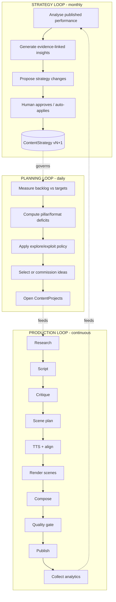
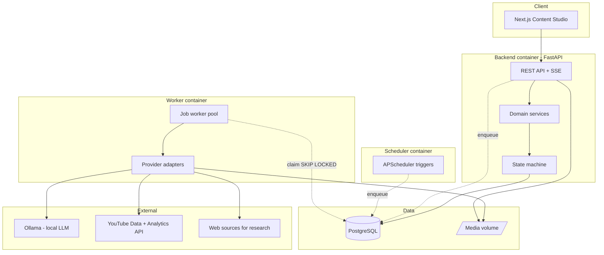
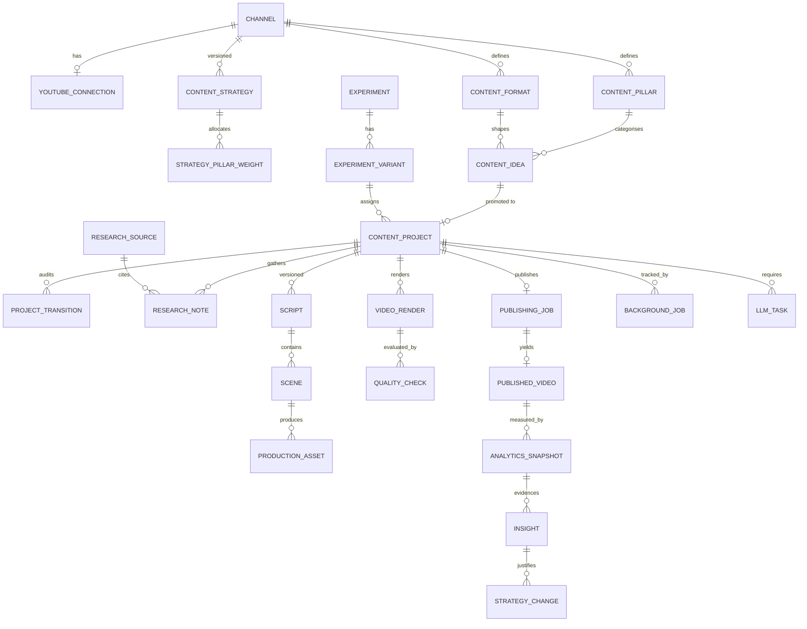
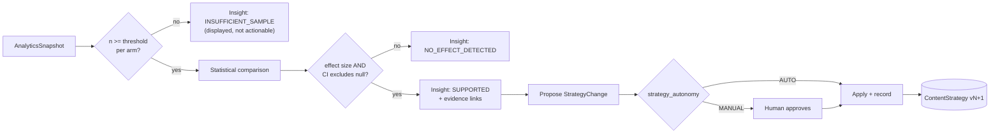
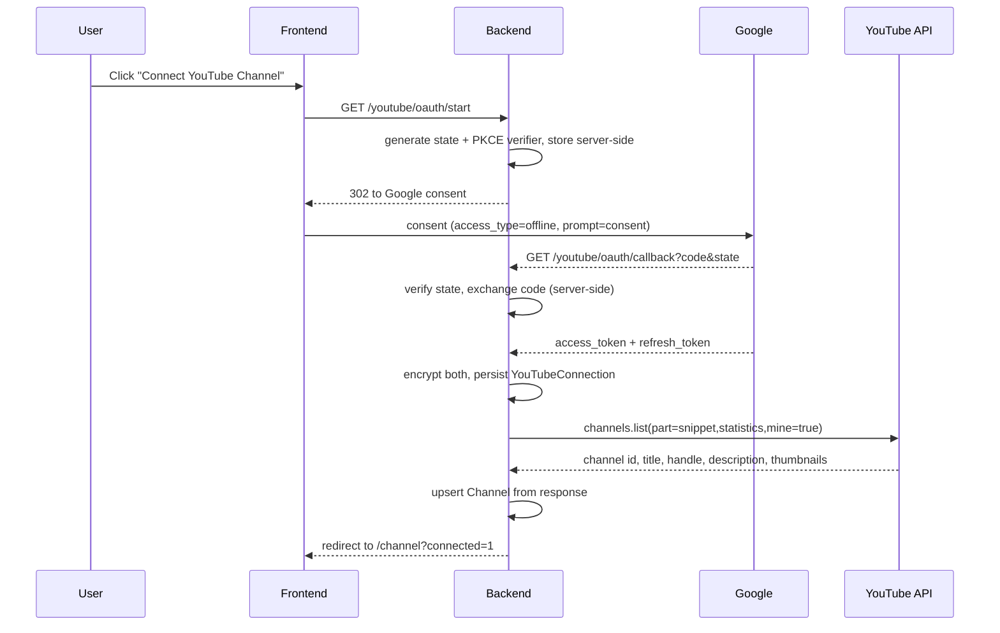
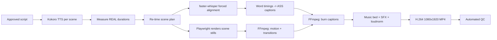

# Phase 1 — Product & Technical Design
### YouTube Autonomous Content Studio

> Status: **Design only. No application code written yet.**
> Date: 2026-08-23
> This document is the contract for Phase 0–2 implementation. Update it when architecture changes.

---

## 0. How To Read This

Sections 1–3 are the product argument — read these even if you skip everything else.
**Section 2 is the most valuable part of this document**: it is where I disagree with the brief.
**Section 3 contains verified external constraints. Two of them invalidate parts of the original plan.**
Sections 4–15 are the technical design. Sections 16–17 are sequencing and risk.

---

## 1. Refined Product Vision

### 1.1 What this actually is

The brief describes an "autonomous YouTube content OS". After checking the real constraints, the honest and more useful framing is:

> **A content operations system that removes ~95% of the labour of running a technical edutainment channel, concentrates the remaining human judgment into two short decision points per video, and accumulates a structured, evidence-linked memory of what works — so decision quality compounds instead of resetting every week.**

The distinction matters. "Fully autonomous" is:

- **not achievable at zero cost** — script quality is the binding constraint, and free local LLMs are not good enough to write hooks that hold an 18–35 audience;
- **not safe** under YouTube's current monetization policy (§3.4), which explicitly targets mass-produced, templated, minimal-human-contribution content;
- **not useful early**, because with zero subscribers there is no performance signal to be autonomous *about*.

So the V1 target metric is not "videos produced without a human". It is:

```
<= 10 minutes of human judgment per published video
 0 minutes of human labour on research assembly, timing, rendering,
   captioning, scheduling, analytics collection, or strategy bookkeeping
```

Autonomy is then **earned incrementally, gate by gate**, as evidence accumulates. Every human gate has a configurable `autonomy_level` and can be flipped to automatic without redesign. That is the correct meaning of "progressive autonomy".

### 1.2 The three loops

The system is three nested loops at different frequencies, not one pipeline.



**Why this framing changes the build order:** most people build L1, bolt on L2, then L3. That fails because L3 needs 3–6 months of data before it produces anything but noise. So: **build L1 properly, capture L3's raw data from day one, and do not build L3's decision logic until the data exists** (§16).

### 1.3 What "commercially valuable audience" means technically

The brief correctly says do not optimize for raw views. Concretely: the system's objective function must not be `views`.

| Revenue path | Leading indicator the system should optimize |
|---|---|
| AdSense / Premium | `estimatedMinutesWatched`, `averageViewPercentage` |
| Sponsorship / affiliate | `subscribersGained` per 1k views; audience geography (Tier-1 %) |
| SaaS partnership / own product | subscriber quality — do viewers of *tool* content return? |
| Long-term brand equity | publish consistency; non-templated variety; comment sentiment |

The planner's objective is a weighted composite **dominated by retention and subscriber conversion**, with views as a scaling term, not the target (§10.3, §11.4).

---

## 2. Assumptions I Am Challenging

Ordered by how much time and money each one saves you.

### 2.1 ❌ "Zero paid APIs" and "autonomous LLM pipeline" are in direct conflict

Every stage of the brief's pipeline needs an LLM: ideas, research synthesis, hooks, scripts, critique, scene planning. There is no way around this.

A free local 7–8B model (Qwen2.5-7B, Llama-3.1-8B via Ollama) is genuinely good at **structured, mechanical** work: reformatting, splitting narration into scenes, extracting facts into a schema, generating on-screen text from narration, checking rule compliance. It is genuinely **not good** at the one thing that decides whether a Short succeeds — writing a hook and a 30-second narrative with a voice. That is the highest-leverage 200 words in the product, and an 8B model produces competent, forgettable copy.

**Options**

- **A — Local only (Ollama).** Truly zero cost, fully automatic, low quality ceiling. Realistically: the channel does not grow.
- **B — Free-tier hosted APIs** (Gemini Flash free tier, Groq, OpenRouter free models). Zero cash, real quality. Costs: rate limits, terms that usually permit training on your inputs, availability that changes without notice. **Verify current terms before depending on it.**
- **C — Human-in-the-loop `MANUAL` provider.** The system assembles a complete, context-rich prompt, queues it as an `LLMTask`, and the UI shows it with a copy button. You paste it into Claude (your existing Pro subscription — interactive use, not API), paste the JSON back, and the system validates it against the Pydantic schema and continues automatically. Batchable: one 10-minute session covers a week of scripts.
- **D — Hybrid routing.** Each pipeline stage declares the provider mode it needs.

> **Recommended: Option D — route LOCAL for mechanical stages, MANUAL for the two creative stages (hook set + script draft), EXTERNAL_API as a later drop-in.**
>
> **Reason:** it puts your best available intelligence exactly where quality determines outcomes, spends zero cash, and leaves ~90% of LLM calls fully automatic. It also happens to be the configuration that satisfies YouTube's "meaningful human creative contribution" requirement (§3.4) — the compliance problem and the quality problem have the same solution.
>
> Option B is worth evaluating as a replacement for the **LOCAL tier** once you confirm current terms. It should not replace the MANUAL tier for creative work.

The `LLMTask` queue is therefore **core architecture, not a workaround** (§9.4).

### 2.2 ❌ FFmpeg alone is the wrong visual engine

FFmpeg is the right *compositor and encoder*. It is a poor *design tool* — `drawtext` and `zoompan` filter graphs become unmaintainable at the complexity good motion graphics need, and the output lands on exactly the "stock slideshow" aesthetic that YouTube's policy update names as a demonetization risk.

**Options**

- **A — FFmpeg filters only.** Fastest start, lowest ceiling, brittle, generic look.
- **B — Manim.** Python-native, excellent for algorithm/diagram animation, free. Slow renders, very recognizable "3Blue1Brown" look, awkward for UI mockups and text-heavy scenes.
- **C — Remotion.** React-based video, excellent DX and quality. Adds a Node toolchain to a Python stack; free for individuals but requires a paid licence past a company-size threshold — verify before committing.
- **D — HTML/CSS/SVG scene templates rendered headlessly via Playwright, composited by FFmpeg.**

> **Recommended: Option D.**
>
> **Reason:** scene templates become plain HTML files you can open in a browser and iterate on in seconds; the `Scene` entity maps 1:1 onto `template_id + props_json`; it is driven from Python with no second language runtime; and CSS/SVG gives you a genuine ownable identity (typography, palette, motion curves) instead of a filter-graph aesthetic. Manim can be added later as a second `SceneRenderer` implementation for specialised algorithm scenes — the interface allows it.
>
> **Phase it:** V1 renders 1–4 still keyframes per scene and animates them with FFmpeg (Ken Burns, slide, wipe, cross-fade). V2 adds deterministic frame-by-frame capture by having templates expose `window.seek(t)` so Playwright can step time exactly. Same interface, no redesign.

### 2.3 ❌ Redis + Celery is unjustified complexity here

The workload is tens of jobs/day, minutes long, needing retries, timeouts, idempotency, full history, and — critically — **a durable job record the dashboard renders and that joins to domain entities**. Celery's result backend does not give you that model; you would build a `background_job` table alongside it anyway, and then own two sources of truth about job state.

**Options**

- **A — Celery + Redis.** Standard, heavy, two extra services, state split across Redis and Postgres.
- **B — Dramatiq / RQ + Redis.** Lighter, same split-state problem.
- **C — `procrastinate`** (Postgres-backed queue library). Off-the-shelf, no Redis, asyncio-native, has periodic tasks.
- **D — Own queue on Postgres `SELECT ... FOR UPDATE SKIP LOCKED` over `background_job`, plus APScheduler for periodic triggers.**

> **Recommended: Option D. Option C is the fallback if you would rather not own the code.**
>
> **Reason:** `SKIP LOCKED` claiming is ~150 well-understood lines; it makes `background_job` a single authoritative, joinable record (the project timeline view becomes a plain join, not a Redis scan); it removes a service from Compose; and transactional enqueue-with-state-change eliminates a whole class of "status says RENDERING but no job exists" bugs. Throughput needs are ~3 orders of magnitude below where this strains.
>
> Add Redis when a concrete need appears — response caching, cross-process rate limiting, SSE fan-out. Not before.

### 2.4 ❌ Do not use LangGraph in V1

The brief asks. The answer is no.

This pipeline's state lives in Postgres, spans days, survives restarts, and pauses on human approval. That is a **durable workflow state machine** (§8). LangGraph solves in-memory stateful agent orchestration inside a single task — a different problem. Adding it means two competing state models.

The one place an agent loop is genuinely warranted is research (search → read → extract → assess sufficiency → search again). A bounded `while` loop with a step budget covers that in ~80 lines. Revisit LangGraph only if that node's control flow actually gets complex.

Same reasoning: **no multi-agent framework, no agent-per-role decomposition.** Distinct prompts + Pydantic-validated structured output + a state machine gives the benefit without the debugging cost.

### 2.5 ❌ No vector database in V1

The justified use is "have we already covered this?" across a few hundred ideas. Postgres `pg_trgm` similarity on a normalized `topic_key` plus explicit entity tagging handles that. Revisit `pgvector` (with free local `sentence-transformers` embeddings — still zero cost) when the idea corpus passes ~500 and trigram dedup starts missing. One migration.

### 2.6 ⚠️ The analytics feedback loop cannot work early — a scheduling decision, not a design one

With 0 subscribers, Shorts impressions are almost entirely algorithmic exploration. Per-video variance is enormous. Any "insight" from your first 20 videos is noise-fitting, and the real danger is that the system *acts* on it and locks strategy onto a random walk.

**Recommendation**
- Build analytics **ingestion and snapshotting early (Phase 3)** — you cannot backfill history you failed to record.
- Build **insight generation and strategy mutation late (Phase 7)**, gated behind minimum-sample thresholds the code enforces and the UI displays.
- Until thresholds are met, the Insights screen shows descriptive data plus an explicit `insufficient sample (n=7, need >=12/arm)` state. It must be **structurally impossible** for the system to claim a conclusion it cannot support.

### 2.7 ⚠️ The Idea Engine's scores will be LLM-fabricated numbers

`curiosity: 8, broad_appeal: 7, novelty: 6` from an LLM are not measurements — they are plausible-looking tokens. Treated as truth they silently drive the planner.

**Recommendation:** keep them, but (a) name them `heuristic_*` in schema and UI, (b) never display them without the caveat, and (c) **calibrate them**. Once ≥30 videos are published, correlate each predicted score against actual retention and store the result as an `Insight`. If `heuristic_curiosity` shows no correlation with `averageViewPercentage`, drop it from the planner weighting. Cheap to build, and it converts a guess into a testable instrument.

### 2.8 ⚠️ Twelve UI screens for a single user is over-scoped

V1 needs 5 (§12). The rest are views over data that does not exist yet; building them costs weeks and teaches nothing.

### 2.9 ✅ What I agree with, strongly

- Provider abstraction with LOCAL / MANUAL / EXTERNAL modes — correct and load-bearing.
- Broad-curiosity titles over topic-name titles — the single highest-leverage content decision in the brief.
- Facts stored separately from ideas, with sources — essential, and also a compliance asset.
- Explicit workflow states with transition auditing — correct.
- No microservices, no Kubernetes, single VPS — correct.
- Strategy changes recording old/new/reason/metrics/n/timestamp/initiator — correct and non-negotiable.
- Kill switch on auto-publishing — correct.

---

## 3. Verified External Constraints

The brief said *"Do not invent API availability. Verify what YouTube actually exposes."* I did. Several of my own priors were wrong, and **§3.1 changes the publishing architecture fundamentally.**

### 3.1 🔴 API uploads from an unverified project are permanently locked to private

All videos uploaded via `videos.insert` from an API project created after 28 July 2020 that has not passed a compliance audit are **restricted to private**. Per Google's own support documentation, **this cannot be appealed** — the video must be re-uploaded via a verified API project or via the YouTube app/site.

**This is not a soft limitation. It means every video the system uploads before the audit passes is wasted.** An architecture that assumes "upload via API, review, then flip to public" does not work: the video is permanently stuck.

**Architectural consequence — the single most important design decision in this document:**

> **Reads are unrestricted. Writes are not. So V1 automates 100% of reads and hands off exactly one write.**

The `PublishingProvider` interface therefore has three implementations from day one:

| Mode | Behaviour | When |
|---|---|---|
| `MANUAL_HANDOFF` | System produces final MP4 + title + description + tags + thumbnail + a publish checklist. Human uploads via YouTube Studio (~60s). System then **auto-reconciles** the new video back to the project by polling the channel's uploads playlist (a read call — always allowed). | **V1 default** |
| `API_PRIVATE_ONLY` | Real `videos.insert`, honestly labelled: output is permanently private. | Testing the upload path only |
| `API_FULL` | Full automated publish + schedule. | After the compliance audit passes |

`MANUAL_HANDOFF` is not a downgrade — it is the only path that lets you actually grow a channel while the audit is pending, and the auto-reconciliation step means analytics, strategy, and the learning loop remain fully automatic. The human's 60 seconds sits inside the ~10-minute budget from §1.1.

**Action item:** submit the *YouTube API Services — Audit and Quota Extension Form* once the system produces real videos and the channel has genuine content. Audits of empty channels do not go well.

### 3.2 🟢 Upload quota is not a constraint; search quota is

Current allocation, verified against Google's docs: **100 `search.list` calls/day, 100 `videos.insert` calls/day, and 10,000 units/day shared across all other endpoints.** A video upload now costs 1 unit and draws on its own dedicated 100-call bucket.

- My prior belief (`videos.insert` = 1600 units against the shared 10,000 pool, ~6 uploads/day) was **outdated** — that model changed in the December 2025 / June 2026 revisions.
- Practical read: 5 Shorts/week is nowhere near the 100/day upload ceiling.
- **The real constraint is `search.list` at 100 calls/day.** Do not architect a trend-discovery crawler on YouTube search. Budget it deliberately: a `QuotaLedger` table tracking daily consumption per endpoint, with the client refusing calls that would exceed budget.

### 3.3 🟠 OAuth refresh tokens expire after 7 days while the consent screen is in "Testing"

For an **External** OAuth consent screen in **Testing** publishing status, issued refresh tokens expire after exactly 7 days; subsequent use returns `invalid_grant`. Moving the app to **In Production** removes the 7-day expiry (Internal is unavailable without Google Workspace).

**Consequences:**
1. The setup guide must instruct: set publishing status to **In Production**. Unverified is acceptable for a single user — you will click through an "unverified app" warning screen.
2. Regardless, **treat token loss as a normal, expected event, not an error path.** `YouTubeConnection` gets an explicit `status` enum (`ACTIVE / EXPIRED / REVOKED / ERROR`), the dashboard surfaces it prominently, background jobs that hit `invalid_grant` transition the connection and pause dependent jobs rather than failing them permanently, and one click re-authorizes.

### 3.4 🔴 YouTube's inauthentic-content policy targets exactly the naive version of this product

On 15 July 2025 YouTube renamed its "repetitious content" policy to **"inauthentic content"** to make clear that mass-produced material is outside monetization standards. Current guidance explicitly names as monetization risks: **templated scripts with minor substitutions, slideshows with little narration, generic AI templates, disconnected AI clips, and synthetic personas.** Enforcement is a three-strike path — warning, 90-day suspension, permanent YPP removal.

Critically, **there is no blanket ban on AI-generated video.** The test is whether there is meaningful original creative contribution: original direction, meaningful variation, useful information, distinctive narrative.

**This makes policy compliance an architectural requirement, not a disclaimer.** Concretely, the system must:

| Requirement | Mechanism | Where |
|---|---|---|
| Meaningful human creative contribution | `MANUAL` LLM tier for hooks/scripts + mandatory approval gate | §2.1, §8 |
| Meaningful variation between videos | **Similarity gate**: block publishing if a script's n-gram/structural similarity to any previously published script exceeds a threshold | §13.3 |
| Not a slideshow with narration over it | Purpose-built motion graphics with an owned visual identity | §2.2, §14 |
| Real information, not model recall | Research pipeline with cited, dated sources | §7, §13 |
| Disclosure where required | `contains_synthetic_media` flag on the publish checklist | §13 |

The similarity gate is the load-bearing one. A system that generates 5 Shorts/week from 4 format templates will drift toward templated sameness unless something actively measures and blocks it.

### 3.5 🟢 Analytics API: what is actually available

Verified against the YouTube Analytics API reference.

**Available metrics:** `views`, `engagedViews` (views past the initial seconds), `estimatedMinutesWatched`, `averageViewDuration`, `averageViewPercentage`, `likes`, `dislikes`, `comments`, `shares`, `subscribersGained`, `subscribersLost`, `estimatedRevenue`.

**Available dimensions:** `day`, `month`; `video`, `playlist`, `channel` (as filters, up to 500 IDs); `insightTrafficSourceType` and `insightTrafficSourceDetail`; `country`, `province`, `city`, `dma`, `continent`, `subContinent`.

**🟢 Key find:** the **`creatorContentType`** dimension exists with values `SHORTS`, `VIDEO_ON_DEMAND`, `LIVE_STREAM`, `STORY`, `UNSPECIFIED`, with data from 1 January 2019. This is essential — it lets the system cleanly separate Shorts performance from long-form instead of pooling incomparable formats.

**🟠 Honest limitations to model, not paper over:**
- There is **no Shorts "viewed vs swiped away" metric in the API**. That figure exists only in the Studio UI. The system must use `engagedViews / views` and `averageViewPercentage` as the closest available proxies, and the UI must label them as proxies.
- `averageViewPercentage` excludes looping-clip traffic (since Dec 2021) and **cannot be combined with the `liveOrOnDemand` dimension** — requires a separate report call.
- Analytics data lags real time by roughly 24–48 hours. Snapshot ages (§11.2) must account for this; a T+1h snapshot would be meaningless.

### 3.6 🟢 Local TTS is viable at production quality

Kokoro-82M is Apache-2.0 licensed (commercial use permitted, no per-character billing), runs at or above real-time on CPU with no GPU, and reached #1 on the TTS Arena leaderboard in January 2026, beating models 10–100× its size. For short-form American English narration this is genuinely close to paid TTS quality.

**Conclusion: TTS is a solved, zero-cost part of this stack.** Kokoro primary, Piper as a fast fallback. This is the one part of the "zero budget" constraint that costs you nothing in quality.

### 3.7 Summary of what changed versus the brief

| Brief assumed | Verified reality | Design response |
|---|---|---|
| API upload then set public | Permanently private until audit; no appeal | `MANUAL_HANDOFF` publishing provider is the V1 default (§3.1, §13) |
| `videos.insert` = 1600 units, ~6/day | 1 unit, own 100-call/day bucket | Upload volume is a non-issue; **search** is the scarce quota (§3.2) |
| Offline refresh tokens persist | 7-day expiry while consent screen is in Testing | Connection health is a first-class, surfaced state (§3.3, §13.2) |
| Automation is a neutral choice | Policy explicitly targets templated mass production | Similarity gate + human creative tier are mandatory (§3.4) |
| Shorts retention available via API | Swipe-away rate is Studio-only | Use `engagedViews` ratio + `averageViewPercentage`, labelled as proxies (§3.5) |
| Free TTS will be a quality compromise | Kokoro is genuinely production-grade on CPU | No compromise needed (§3.6) |

---

## 4. V1 Scope

### 4.1 In scope

1. Single channel, Shorts only, English.
2. YouTube OAuth connect, automatic channel metadata sync, connection health monitoring.
3. Content pillars, formats, and a versioned strategy — configurable, seeded with the brief's six pillars and four formats.
4. Idea pool with structured fields, heuristic scores (labelled), and trigram dedup against published topics.
5. Research: source capture, fact extraction with citation and confidence, staleness checking.
6. Script generation via hybrid LLM routing, versioned, with hook candidates and a selected hook.
7. Scene plan: structured scenes with narration, on-screen text, template + props.
8. Production: Kokoro TTS → forced alignment → scene stills via Playwright → FFmpeg composition → burned animated captions → loudness normalization.
9. Quality gates: automated checks (§13.3) producing a structured verdict with blocking issues.
10. Human review gates at script and final video.
11. Publishing via `MANUAL_HANDOFF`, with automatic reconciliation of the uploaded video back to the project.
12. Analytics ingestion: daily snapshots at fixed video ages, Shorts-filtered.
13. Backlog planner: measures deficits, commissions work, respects guardrails.
14. Postgres-backed job queue with retries, timeouts, idempotency, and full history.
15. Five-screen UI (§12).
16. Docker Compose for local and VPS, identical topology.

### 4.2 Explicitly out of scope for V1

Long-form video. Multi-channel / multi-tenant. Billing, RBAC, auth beyond a single-user session. Thumbnail A/B testing (not exposed in the API for Shorts). Automated public publishing (blocked by §3.1). Insight generation and automatic strategy mutation (deferred to Phase 7 by §2.6). Comment management. Vector search. Kubernetes. Paid providers.

### 4.3 Definition of done for V1

> The system independently maintains a backlog of ≥5 review-ready Shorts, requiring from you only: (a) one batched LLM paste session per week, (b) approval of scripts and finished videos, and (c) a 60-second upload per video — while automatically collecting and correctly normalizing performance data for every published video.

---

## 5. Architecture

### 5.1 System topology



Three processes, one database, one media volume, one codebase. No message broker, no service mesh.

### 5.2 Layering

```
api/          HTTP only. Pydantic in, Pydantic out. No business logic.
services/     Domain logic. Owns transactions and state transitions.
jobs/         Job definitions. Thin - each job calls one service method.
providers/    Swappable external capability adapters behind interfaces.
integrations/ Concrete third-party clients (YouTube, web fetch).
models/       SQLAlchemy ORM.
core/         State machine, errors, logging, security, config.
```

**Hard rule: a job is never more than a thin wrapper around a service call.** This keeps every pipeline step invokable synchronously from a test or the API, which is what makes the system debuggable.

### 5.3 Provider interfaces

Every external capability sits behind an interface with a `ProviderMode` of `LOCAL | MANUAL | EXTERNAL_API`.

```python
class ProviderMode(StrEnum):
    LOCAL = "local"
    MANUAL = "manual"
    EXTERNAL_API = "external_api"

class LLMProvider(Protocol):
    mode: ProviderMode
    async def complete(self, task: LLMTaskSpec) -> LLMResult: ...
    # MANUAL impl raises Deferred(task_id) - the job suspends, not fails.

class TTSProvider(Protocol):
    async def synthesize(self, text: str, voice: VoiceSpec) -> AudioAsset: ...

class AlignmentProvider(Protocol):
    # Named for what we use STT for: word timings against known text.
    async def align(self, audio: Path, transcript: str) -> list[WordTiming]: ...

class SceneRenderer(Protocol):
    async def render(self, scene: SceneSpec) -> list[FrameAsset]: ...

class VideoCompositor(Protocol):
    async def compose(self, spec: CompositionSpec) -> VideoAsset: ...

class PublishingProvider(Protocol):
    async def publish(self, req: PublishRequest) -> PublishResult: ...
    async def reconcile(self, project_id: UUID) -> PublishResult | None: ...
```

V1 bindings: `LLM → Hybrid(Ollama, Manual)`, `TTS → Kokoro`, `Alignment → faster-whisper`, `SceneRenderer → PlaywrightStills`, `Compositor → FFmpeg`, `Publishing → ManualHandoff`.

**Note on `AlignmentProvider`:** the brief listed STT without stating why. The reason is caption timing — we already know the words (we wrote them), so this is *forced alignment*, not transcription. Running recognition on our own TTS output and constraining it to the known transcript yields word-level timings for animated captions. Naming the interface `align` rather than `transcribe` prevents future confusion.

---

## 6. Project Structure

```
contentstudio/
├── docker-compose.yml
├── docker-compose.prod.yml
├── .env.example
├── README.md
├── docs/
│   └── PHASE-1-ARCHITECTURE.md
├── backend/
│   ├── pyproject.toml
│   ├── Dockerfile
│   ├── alembic/versions/
│   └── app/
│       ├── main.py
│       ├── config.py
│       ├── core/
│       │   ├── state_machine.py
│       │   ├── errors.py
│       │   ├── logging.py
│       │   └── crypto.py            # token encryption at rest
│       ├── db/{session.py,base.py}
│       ├── models/                  # one module per aggregate
│       ├── schemas/
│       ├── api/routes/
│       ├── services/
│       │   ├── planner/
│       │   ├── ideas/
│       │   ├── research/
│       │   ├── scripting/
│       │   ├── production/
│       │   ├── publishing/
│       │   ├── analytics/
│       │   ├── quality/
│       │   └── strategy/
│       ├── providers/
│       │   ├── llm/{ollama.py,manual.py,hybrid.py}
│       │   ├── tts/{kokoro.py,piper.py}
│       │   ├── alignment/faster_whisper.py
│       │   ├── renderer/playwright_stills.py
│       │   └── compositor/ffmpeg.py
│       ├── integrations/youtube/
│       │   ├── oauth.py
│       │   ├── data_api.py
│       │   ├── analytics_api.py
│       │   └── quota.py
│       ├── jobs/
│       │   ├── queue.py             # SKIP LOCKED claim/ack/retry
│       │   ├── worker.py
│       │   ├── scheduler.py
│       │   └── tasks/
│       └── prompts/                 # versioned prompt templates
├── scene_templates/                 # HTML/CSS/SVG - the visual identity
│   ├── _base/{tokens.css,motion.css,fonts/}
│   ├── title_card/
│   ├── diagram_flow/
│   ├── comparison/
│   ├── ui_mockup/
│   └── stat_reveal/
├── media/                           # volume: assets/, renders/, cache/
└── frontend/
```

**`scene_templates/` sits at the repo root, not inside `backend/`, on purpose.** It is the channel's visual identity — a design asset, iterated by opening HTML in a browser, and it will eventually be consumed by more than one renderer.

---

## 7. Database Design

PostgreSQL. UUIDv7 primary keys (time-ordered, index-friendly). `created_at` / `updated_at` on every table. JSONB for genuinely variable payloads only — anything queried or filtered gets a real column.

### 7.1 Entity map



### 7.2 Tables that need specific care

**`youtube_connection`** — the security-sensitive one.

```
id, channel_id FK unique
google_account_email
access_token_enc      bytea    -- Fernet/AES-GCM, key from env, never logged
refresh_token_enc     bytea
access_token_expires_at
scopes                text[]
status                enum(ACTIVE, EXPIRED, REVOKED, ERROR)   -- see 3.3
last_refreshed_at, last_error, last_error_at
consent_publishing_status  enum(TESTING, PRODUCTION)  -- drives the 7-day warning
audit_status          enum(UNAUDITED, SUBMITTED, APPROVED)    -- drives 3.1 gating
```

Constraints: exactly one connection per channel. Tokens are never returned by any API endpoint, never logged, and are encrypted at rest with a key from `SECRETS_KEY` (env, not in the DB).

**`content_project`** — the aggregate root.

```
id, idea_id FK, pillar_id FK, format_id FK
status                 enum  -- master state, see section 8
substatus_detail       text
autonomy_level         enum(MANUAL, ASSISTED, AUTO)
priority               int
target_duration_seconds int
experiment_variant_id  FK null
current_script_id      FK null
current_render_id      FK null
topic_key              text   -- normalized, trigram-indexed for dedup
scheduled_publish_at   timestamptz null
failure_reason, retry_count
created_by             enum(HUMAN, PLANNER)
```

Indexes: `(status)`, `(status, priority DESC)` for planner queries, GIN trigram on `topic_key`.

**`research_note`** — facts, kept strictly separate from ideas.

```
id, project_id FK, source_id FK
claim               text        -- one atomic factual statement
claim_type          enum(FACT, FIGURE, QUOTE, EVENT, DEFINITION)
confidence          enum(HIGH, MEDIUM, LOW)
verification_status enum(UNVERIFIED, CORROBORATED, DISPUTED, REJECTED)
corroborating_source_ids uuid[]
used_in_script      bool
```

**`research_source`** carries `url`, `title`, `publisher`, `published_at`, `retrieved_at`, `content_hash`, `archive_path`, `source_tier`. `published_at` + `retrieved_at` drive staleness rules: a "current/trending" project requires ≥1 source published within 30 days.

**`scene`** — the renderer-agnostic contract from the brief, made concrete.

```
id, script_id FK, scene_number int
start_seconds numeric(6,3), end_seconds numeric(6,3)   -- derived from real TTS audio, never guessed
narration text
on_screen_text text
visual_instruction text            -- human/LLM intent
template_id text                   -- resolves to scene_templates/<id>/
template_props jsonb               -- validated against the template's JSON schema
asset_type enum(MOTION_GRAPHIC, DIAGRAM, UI_MOCKUP, STAT_REVEAL, TITLE_CARD, STOCK)
transition_in, transition_out
sfx_cue text null
```

Unique on `(script_id, scene_number)`. Separating `visual_instruction` (intent) from `template_id + template_props` (executable spec) is what makes scenes consumable by future renderers.

**`publishing_job`** — the double-upload guard (§13.4).

```
id, project_id FK, render_id FK
provider_mode        enum(MANUAL_HANDOFF, API_PRIVATE_ONLY, API_FULL)
idempotency_key      text UNIQUE   -- sha256(project_id|render_id|attempt_group)
resumable_session_uri text null    -- persisted across retries
state                enum(PENDING, AWAITING_HUMAN_UPLOAD, UPLOADING, PROCESSING, DONE, FAILED)
youtube_video_id     text null
```

Plus: `CREATE UNIQUE INDEX ... ON publishing_job(project_id) WHERE state NOT IN ('DONE','FAILED')` — at most one live publishing job per project, enforced by the database.

**`published_video`** — `youtube_video_id` is `UNIQUE NOT NULL`. Belt and braces against duplicates.

**`analytics_snapshot`** — the shape that makes learning possible.

```
id, published_video_id FK
snapshot_at timestamptz
video_age_hours int                 -- THE key field
age_bucket enum(H24, H72, D7, D28, D90)
creator_content_type text           -- 'SHORTS', from the API dimension
views, engaged_views, estimated_minutes_watched
average_view_duration_seconds numeric
average_view_percentage numeric
likes, comments, shares, subscribers_gained, subscribers_lost
traffic_sources jsonb
geography jsonb
is_final bool                       -- true once the age bucket has closed
```

Unique on `(published_video_id, age_bucket)`. **Age bucketing is not cosmetic** — comparing lifetime totals across videos of different ages is the single most common analytics mistake, and this schema makes it hard to commit.

**`background_job`** — the queue (§9).

```
id, job_type text, payload jsonb
status enum(QUEUED, CLAIMED, RUNNING, SUCCEEDED, FAILED, DEAD, CANCELLED)
priority int, run_after timestamptz, claimed_at, claimed_by text
heartbeat_at timestamptz, timeout_seconds int
attempt int, max_attempts int
idempotency_key text UNIQUE null
project_id FK null                 -- joinable to the domain, deliberately
error_text, error_class, traceback
```

Indexes: `(status, run_after, priority DESC)` partial on `status='QUEUED'` for the claim query; `(project_id)`.

**`llm_task`** — makes the MANUAL provider a first-class citizen.

```
id, project_id FK null, stage enum, provider_mode enum
prompt_text text, context_bundle jsonb
response_schema jsonb
status enum(PENDING, DISPATCHED, AWAITING_PASTE, VALIDATED, REJECTED, FAILED)
raw_response text null, parsed_response jsonb null
validation_errors jsonb, model_used text, resumed_job_id FK
```

**`strategy_change`** — the auditability requirement from the brief, enforced as `NOT NULL` columns:

```
id, strategy_id FK, field_path text
old_value jsonb NOT NULL, new_value jsonb NOT NULL
reason text NOT NULL
supporting_insight_ids uuid[] NOT NULL
sample_size int NOT NULL
initiator enum(HUMAN, SYSTEM) NOT NULL
applied_at timestamptz, reverted_at timestamptz null
```

A strategy change that cannot cite its evidence and sample size **cannot be inserted**. That is deliberate.

### 7.3 Cross-cutting constraints

- Exactly one active strategy: `CREATE UNIQUE INDEX ... ON content_strategy(channel_id) WHERE is_active`.
- Pillar weights sum to 1.0 per strategy version — enforced in a service-layer transaction, and checked by a nightly consistency job.
- All money/percentage fields are `numeric`, never `float`.
- All timestamps `timestamptz`, stored UTC. `posting_window` stored with an explicit IANA timezone — publish timing is audience-local, and getting this wrong silently corrupts the time-of-day experiment.
- Soft-delete only where audit matters (`strategy_change`, `published_video`); hard delete elsewhere.

---

## 8. Workflow State Machine

### 8.1 The correction to the brief's state list

The brief's list mixes concerns — `RENDERING` is a project state, but `SCRIPT_APPROVED` is really a property of a *script*, and a project can have several script versions. Modelling all of it as one flat enum causes ambiguity the moment anything is revised.

**Design: one master `ContentProject.status`, plus independent lifecycle states on the sub-resources (`Script.status`, `VideoRender.status`, `PublishingJob.state`), plus an append-only `project_transition` audit table.**

### 8.2 Master project state machine

```mermaid
stateDiagram-v2
    [*] --> IDEA
    IDEA --> IDEA_APPROVED : score >= threshold OR human approves
    IDEA --> REJECTED : duplicate / off-strategy
    IDEA_APPROVED --> RESEARCHING
    RESEARCHING --> RESEARCH_READY : sufficiency met
    RESEARCHING --> NEEDS_REVISION : insufficient sources
    RESEARCH_READY --> SCRIPT_GENERATING
    SCRIPT_GENERATING --> SCRIPT_REVIEW : draft + self-critique done
    SCRIPT_GENERATING --> AWAITING_LLM_INPUT : MANUAL tier deferred
    AWAITING_LLM_INPUT --> SCRIPT_GENERATING : response validated
    SCRIPT_REVIEW --> SCRIPT_APPROVED : gate passed
    SCRIPT_REVIEW --> NEEDS_REVISION : rejected with notes
    SCRIPT_APPROVED --> PRODUCTION_PLANNING
    PRODUCTION_PLANNING --> ASSETS_REQUIRED : manual asset needed
    PRODUCTION_PLANNING --> ASSETS_READY : all auto-generatable
    ASSETS_REQUIRED --> ASSETS_READY : human supplies asset
    ASSETS_READY --> RENDERING
    RENDERING --> VIDEO_REVIEW : render + auto-QC passed
    RENDERING --> FAILED : unrecoverable
    VIDEO_REVIEW --> APPROVED_FOR_PUBLISHING
    VIDEO_REVIEW --> NEEDS_REVISION
    APPROVED_FOR_PUBLISHING --> SCHEDULED
    SCHEDULED --> PUBLISHING
    PUBLISHING --> AWAITING_HUMAN_UPLOAD : MANUAL_HANDOFF mode
    AWAITING_HUMAN_UPLOAD --> PUBLISHED : reconciled from uploads playlist
    PUBLISHING --> PUBLISHED : API_FULL mode
    PUBLISHING --> FAILED
    PUBLISHED --> ANALYTICS_COLLECTING
    ANALYTICS_COLLECTING --> COMPLETED : D28 snapshot final
    NEEDS_REVISION --> RESEARCHING
    NEEDS_REVISION --> SCRIPT_GENERATING
    NEEDS_REVISION --> RENDERING
    NEEDS_REVISION --> ARCHIVED : abandoned
    FAILED --> NEEDS_REVISION : human retriage
    COMPLETED --> [*]
    REJECTED --> [*]
    ARCHIVED --> [*]
```



Additions to the brief's list, each earning its place: `AWAITING_LLM_INPUT` (the MANUAL tier suspends rather than fails), `PUBLISHING` split from `AWAITING_HUMAN_UPLOAD` (§3.1), `COMPLETED` (analytics window closed — without it, `ANALYTICS_COLLECTING` is terminal and the daily job polls forever), `ARCHIVED` (abandoned but retained for dedup history).

### 8.3 Implementation rules

1. Transitions go through **one** function: `transition(project, to_state, actor, reason, ctx)`. Nothing else writes `status`.
2. Legal transitions live in an explicit `dict[State, set[State]]`. Illegal transitions raise, and the test suite asserts the graph has no unreachable states and no non-terminal sinks.
3. Every transition writes a `project_transition` row (`from`, `to`, `actor`, `reason`, `job_id`, `at`) in the **same transaction** as the status update.
4. Entering a state may enqueue the next job — also in the same transaction. This is why the Postgres-backed queue (§2.3) matters: state change and job enqueue are atomic. With Redis they are not, and you get lost or duplicated work at exactly the wrong moments.
5. Human-gated states (`SCRIPT_REVIEW`, `VIDEO_REVIEW`, `ASSETS_REQUIRED`, `AWAITING_LLM_INPUT`, `AWAITING_HUMAN_UPLOAD`) consult `project.autonomy_level` — at `AUTO` with a passing quality gate, the state machine self-advances. **This is the single mechanism through which the whole system becomes more autonomous over time.** No rewrite required; it is a config change per gate.

---

## 9. Background Job Architecture

### 9.1 Claiming

```sql
UPDATE background_job SET
  status='CLAIMED', claimed_at=now(), claimed_by=:worker_id,
  heartbeat_at=now(), attempt=attempt+1
WHERE id = (
  SELECT id FROM background_job
  WHERE status='QUEUED' AND run_after <= now()
  ORDER BY priority DESC, run_after
  FOR UPDATE SKIP LOCKED LIMIT 1
)
RETURNING *;
```

Workers poll on a short interval with jitter. `LISTEN/NOTIFY` can remove the polling latency later; it is not needed at this volume.

### 9.2 Reliability guarantees

| Requirement | Mechanism |
|---|---|
| Retries | `attempt < max_attempts` → requeue with exponential backoff + jitter; else `DEAD` |
| Timeouts | Worker heartbeats every 15s; a reaper requeues jobs whose `heartbeat_at` is older than `timeout_seconds` |
| Idempotency | Unique `idempotency_key`; enqueue is `ON CONFLICT DO NOTHING` |
| History | Rows are never deleted, only archived after 90 days |
| Failure states | `error_class` + `traceback` persisted; distinguishes retryable from terminal |
| Structured logging | Every log line carries `job_id`, `project_id`, `job_type`, `attempt` |
| Recovery | On startup a worker requeues its own orphaned `CLAIMED`/`RUNNING` rows |
| Poison-pill safety | `DEAD` jobs surface on the dashboard and never auto-retry |

**Crucial distinction the brief implies but does not state:** jobs must separate **retryable** failures (network, timeout, transient provider error) from **terminal** ones (validation failure, policy violation, missing asset). Blind retry on a terminal failure burns quota and, in the publishing path, risks exactly the double-upload the brief forbids. Every job declares its retryable exception set explicitly.

### 9.3 Scheduled triggers (APScheduler in the scheduler container)

| Job | Cadence | Purpose |
|---|---|---|
| `refresh_youtube_tokens` | hourly | Refresh before expiry; flip connection to `EXPIRED` on `invalid_grant` |
| `sync_channel_metadata` | daily | Channel stats, uploads playlist |
| `reconcile_pending_publishes` | every 15 min | Match human uploads back to projects (§13.5) |
| `collect_analytics` | daily 03:00 | Snapshot every video whose age bucket is due |
| `run_content_planner` | daily 06:00 | The backlog loop (§10) |
| `reap_stale_jobs` | every 2 min | Requeue dead-worker jobs |
| `check_research_staleness` | weekly | Flag trending projects with aged sources |
| `generate_insights` | monthly | **Phase 7 only** |

### 9.4 The MANUAL provider suspend/resume mechanism

This is the piece that makes §2.1 work, and it is worth being precise about.

```mermaid
sequenceDiagram
    participant J as Job (generate_script)
    participant P as HybridLLMProvider
    participant DB as Postgres
    participant U as You (UI)

    J->>P: complete(task_spec, tier=CREATIVE)
    P->>DB: INSERT llm_task (PENDING) with full prompt
    P-->>J: raise Deferred(task_id)
    J->>DB: project -> AWAITING_LLM_INPUT; job -> SUCCEEDED (suspended, not failed)
    Note over U: Batch view shows N pending tasks
    U->>U: copy prompt -> Claude -> copy JSON back
    U->>DB: POST /llm-tasks/{id}/response
    DB->>DB: validate against response_schema
    alt valid
        DB->>DB: enqueue generate_script (resumed) with llm_task_id
        Note over J: job re-runs, provider returns the stored result
    else invalid
        DB->>U: show validation errors, keep AWAITING_PASTE
    end
```

Two design points that matter: the deferred job **succeeds** rather than fails (a suspended job is not an error, and treating it as one poisons your job-failure metrics), and the resumed job is **the same job type re-run**, with the provider returning the stored response instead of deferring. That keeps one code path for both modes — swapping to `EXTERNAL_API` later changes nothing in the job.

---

## 10. Autonomous Planner Design

### 10.1 The question it answers

> Given the strategy, the backlog, what has been published, what is performing, and what the system can actually produce — what should be created next, and how much of it?

Runs daily. Every decision is persisted with its reasoning.

### 10.2 Algorithm

```
1. MEASURE
   ready        = count(status in APPROVED_FOR_PUBLISHING, SCHEDULED)
   in_flight    = count(status between IDEA_APPROVED and VIDEO_REVIEW)
   idea_pool    = count(ideas status=APPROVED, unpromoted)
   publish_rate = published in last 7 days

2. DIAGNOSE
   ready_deficit  = max(0, target_ready - ready)
   rate_deficit   = max(0, target_per_week - publish_rate)
   pool_deficit   = max(0, min_idea_pool - idea_pool)

3. GUARDRAILS  (checked before any commissioning)
   - in_flight <= max_concurrent_projects
   - human_review_queue <= max_review_backlog     <- prevents flooding you
   - pending_llm_tasks  <= max_pending_llm_tasks  <- prevents flooding the manual tier
   - youtube_connection.status == ACTIVE
   - daily search quota remaining (section 3.2)
   - kill_switch_enabled == false
   If violated: log a PlannerDecision(action=THROTTLED, reason=...) and stop.

4. ALLOCATE
   slots = min(ready_deficit + rate_deficit, max_new_projects_per_day)
   for each slot:
       arm = draw from strategy.exploration_policy   # 70 proven / 20 adjacent / 10 novel
       pillar = weighted_choice(pillar_weights, penalised by recent publish share)
       format = weighted_choice(format_weights | pillar)

5. SELECT
   candidates = ideas matching (pillar, format), APPROVED, not duplicate
   rank by composite_score (section 10.3)
   if none: enqueue generate_ideas(pillar, format, n) instead

6. COMMIT
   promote idea -> ContentProject, assign experiment variant if active,
   set scheduled_publish_at from the posting calendar,
   write PlannerDecision with full reasoning, enqueue research job.
```

**Step 3 is the part most designs omit and then regret.** An autonomous planner without backpressure will happily generate 40 projects that all queue up behind your review capacity, and the system becomes useless noise. The review-queue guardrail is what keeps the human loop sustainable.

### 10.3 Composite score — transparent, not a black box

```
score =   w_strategic_fit  * pillar_deficit_normalised
        + w_heuristic      * mean(heuristic_curiosity, heuristic_broad_appeal, heuristic_novelty)
        + w_evidence       * historical_pillar_format_performance   # zero until Phase 7
        + w_freshness      * recency_bonus_if_trending
        - w_difficulty     * production_difficulty
        - w_similarity     * max_similarity_to_recent_published     # section 3.4 defence
```

All weights live in `ContentStrategy`. The UI shows the full term-by-term breakdown for each ranked idea. **A planner you cannot interrogate is a planner you will not trust, and one you will end up overriding by hand — which defeats the purpose.**

`w_evidence` is **0 until sample thresholds are met** (§2.6). Before then the planner is explicitly running on heuristics and strategy, and says so.

### 10.4 Explore vs exploit

V1 uses a **fixed-ratio policy** (70/20/10, configurable), not a bandit.

> **Recommendation: do not implement Thompson sampling or UCB before ~100 published videos.** With n < 30 per arm and the variance Shorts distribution shows, a bandit will converge confidently on noise — which is strictly worse than a fixed ratio, because it *looks* principled. Revisit at 100+.

`PlannerDecision` records `arm_drawn` on every slot, so when you do switch to a bandit the historical data is already in the right shape.

---

## 11. Analytics Feedback Loop

### 11.1 Ingestion

Two API calls per collection run:
- **Data API** `videos.list(part=statistics)` — lifetime `viewCount`, `likeCount`, `commentCount`.
- **Analytics API** `reports.query` — `views, engagedViews, estimatedMinutesWatched, averageViewDuration, averageViewPercentage, subscribersGained, subscribersLost, shares` dimensioned by `day`, filtered by `video==<id>`, **with `creatorContentType==SHORTS`** (§3.5). Traffic sources and geography are separate report calls (dimension combinations are constrained).

### 11.2 Age-cohort snapshots

Snapshots are taken at fixed **video ages**, not fixed calendar dates:

```
H24  -> 24h   (first real signal; API lag makes anything earlier meaningless)
H72  -> 72h   (Shorts distribution decision largely made)
D7   -> 7d    (primary comparison point for experiments)
D28  -> 28d   (near-final; marks the project COMPLETED)
D90  -> 90d   (evergreen tail - which topics keep earning)
```

Every cross-video comparison the system makes **must** be within an age bucket. This is enforced in the query layer, not left to discipline.

### 11.3 Derived metrics

Raw totals are not comparable across videos. The system computes and stores:

```
retention_proxy      = average_view_percentage                  (labelled: proxy)
engagement_ratio     = engaged_views / views                    (closest available to swipe-away)
sub_conversion       = subscribers_gained / views * 1000
watch_efficiency     = estimated_minutes_watched / views
like_rate            = likes / views
tier1_share          = share of views from Tier-1 geographies   (monetization-relevant)
```

### 11.4 From data to decisions — the gate



Method for V1: non-parametric (Mann-Whitney U) on the primary metric per arm, plus a bootstrap CI on the difference in medians, `n >= 12 per arm`. Not because that is rigorous science on observational data — it is not — but because it is honest, it is hard to fool yourself with, and it forces the sample-size conversation. Every `Insight` stores its metric, arms, n per arm, effect size, CI, and the snapshot IDs backing it.

**Every strategy change is reversible.** `strategy_change.reverted_at` plus full version history means a bad automatic adjustment is one click to undo — which is what makes it safe to eventually let the system make them unattended.

---

## 12. Frontend Screen Structure

### 12.1 V1 — five screens

**1. Dashboard** — the operating picture. Sections, in priority order:
- **Needs you now**: scripts awaiting review, videos awaiting review, LLM tasks awaiting paste, videos awaiting upload. Each with a direct action. *This block is the product's primary interface.*
- System health: YouTube connection status (with the §3.3 expiry warning), running jobs, failed/dead jobs, quota consumed today.
- Backlog: ready / in-flight / idea pool against targets, as a simple gauge.
- Recent publications with their H24 numbers.
- Latest planner decisions, in plain language.

**2. Projects** — list filtered by state, plus a project detail view showing the full pipeline timeline (transitions, jobs, artifacts), script, scenes, video preview, and quality report. This is where debugging happens, so it must show *everything* about one project on one page.

**3. Review Queue** — a purpose-built approval surface, not a generic form. Script review shows hook candidates side by side, narration with per-scene timing, and cited facts inline with their sources. Video review plays the vertical MP4 **with the Shorts UI safe-area overlaid** (§14.6). Approve / request revision with notes / reject.

**4. Ideas & Planner** — the idea pool with scores and their term-by-term breakdown, planner decision history with reasoning, and manual idea entry. Includes a "why did the planner choose this?" panel.

**5. Channel & Settings** — YouTube connection, pillars, formats, strategy weights, targets, autonomy levels per gate, **kill switch**, provider configuration.

### 12.2 Deferred to later phases

Research browser (Phase 5 — until then, research is shown inline in project detail). Analytics dashboard (Phase 3 ships ingestion; the dedicated screen comes when there is data worth a screen). Experiments (Phase 7). Insights (Phase 7). Production/asset manager (folded into project detail).

### 12.3 Technical choices

Next.js App Router, TypeScript, server components for data fetching, TanStack Query for mutations, Tailwind, shadcn/ui. **SSE** (not WebSockets) for live job/state updates — the traffic is one-directional and SSE is far less operational overhead. Types generated from the FastAPI OpenAPI schema so the contract cannot drift.

---

## 13. YouTube OAuth & API Architecture

### 13.1 Connect flow



Scopes: `youtube.readonly`, `yt-analytics.readonly`, and `youtube.upload` (requested up front so the audit path does not need re-consent later).

Non-negotiables: the code exchange is server-side only; `access_type=offline` with `prompt=consent` to guarantee a refresh token; `state` verified against a server-side value; tokens encrypted at rest and never sent to the frontend; **no Google password is ever requested or stored**; the channel ID is fetched from `channels.list(mine=true)`, never typed by the user.

### 13.2 Token lifecycle — designed for the §3.3 reality

Hourly refresh job. On `invalid_grant`, the connection moves to `EXPIRED`, dependent jobs move to a paused (not failed) state, and the dashboard shows a reconnect prompt. Setup docs instruct setting the consent screen to **In Production** to avoid the 7-day expiry. The UI displays a persistent warning while `consent_publishing_status = TESTING`.

### 13.3 Quality gates before publishing

Automated checks producing a structured `QualityCheck` with per-check pass/fail and blocking status:

| Check | Method | Blocking |
|---|---|---|
| Factual grounding | Every factual claim in the script maps to a `research_note` | ✅ |
| Source freshness | Trending projects have ≥1 source < 30 days old | ✅ |
| **Script similarity** | n-gram + structural similarity vs all published scripts below threshold | ✅ **(§3.4)** |
| Asset licensing | Every asset has a license record; attribution present where required | ✅ |
| Duration | Within target ± tolerance | ✅ |
| Safe area | On-screen text clears Shorts UI overlays (§14.6) | ✅ |
| Audio | Loudness ≈ -14 LUFS, no clipping, no silence gaps > 1.5s | ✅ |
| Caption coverage | Captions present for the full narration span | ✅ |
| Hook strength | Heuristic + LLM rubric on the first 2 seconds | ⚠️ warn |
| Misleading claims | LLM rubric against a claims checklist | ⚠️ warn |
| Brand/trademark risk | Detect real logos/UI in assets | ⚠️ warn |
| Language quality | Readability + banned-phrase list (no greetings, no fake urgency) | ⚠️ warn |

### 13.4 Never upload twice

Layered, because this is the one failure the brief calls out explicitly:

1. **DB constraint** — partial unique index: at most one non-terminal `publishing_job` per project.
2. **Idempotency key** — `sha256(project_id | render_id | attempt_group)`, unique.
3. **Resumable session persistence** — for API modes, the resumable upload session URI is persisted before any bytes are sent. A retry queries the session's status and *resumes*, rather than starting a new upload. This is the protocol-level solution, and it is why the field is in the schema.
4. **Pre-flight reconciliation** — before any upload attempt, check whether `youtube_video_id` is already set, and scan recent uploads for a matching marker.
5. **Non-retryable classification** — upload jobs treat ambiguous outcomes (timeout after bytes were sent) as terminal-pending-reconciliation, never as blind retry.

### 13.5 MANUAL_HANDOFF reconciliation

The mechanism that keeps the pipeline automatic despite §3.1:

1. Project reaches `AWAITING_HUMAN_UPLOAD`. UI shows the MP4 download, title, description, tags, and a copy-ready metadata block.
2. You upload via YouTube Studio (~60 seconds).
3. `reconcile_pending_publishes` runs every 15 minutes: reads the channel's uploads playlist (read quota, always permitted), matches new videos against pending projects by title and duration.
4. On match: create `published_video`, transition to `PUBLISHED`, begin analytics collection.
5. On ambiguity: surface a one-click "this is the video" confirmation rather than guessing.

From your side this is one upload. Everything downstream stays automatic.

---

## 14. Zero-Cost Media Production

### 14.1 Pipeline



**Step C→D is the one people skip and then fight forever.** Never trust the LLM's estimated scene timings. Synthesize the audio first, measure actual durations, then re-time the scene plan to the real audio. Timing derived from anything else produces drift you will chase for weeks.

### 14.2 Voice

Kokoro-82M (Apache-2.0, CPU real-time, §3.6). Voice, speed, and pitch are `ContentStrategy` variables so they become testable. Piper as a fast fallback.

### 14.3 Captions

Forced alignment gives word-level timings; the system generates an **ASS subtitle file** and burns it with libass. ASS handles per-word highlight, karaoke timing, outlines, and positioning natively — enormously simpler and more reliable than composing `drawtext` filter chains, which is where most FFmpeg caption pipelines become unmaintainable.

### 14.4 Visuals

HTML/CSS/SVG templates at 1080×1920, rendered by Playwright (§2.2). The starting template set:

| Template | Use |
|---|---|
| `title_card` | Hook, payoff |
| `diagram_flow` | Request/response, system flow, pipelines |
| `comparison` | Myth vs reality, before/after, A vs B |
| `ui_mockup` | **Generic, abstracted** app UI — never real product screenshots |
| `stat_reveal` | Numbers, counters, scale demonstrations |

A shared `_base/tokens.css` defines the palette, type scale, spacing, and motion curves. **This file is the channel's visual identity** — the thing that makes output recognizably yours rather than generic, which is both a growth asset and a §3.4 compliance asset.

### 14.5 Legal safety in visuals — a hard rule

The brief's content pillars invite "how Netflix / Uber / Spotify works", which invites logos and screenshots. That is trademark and copyright exposure on a channel whose entire purpose is monetization.

> **Rule: no real logos, no real product screenshots, no scraped UI.** Use generic abstracted mockups that convey the concept. `ui_mockup` is built for this. The brand-risk QC check enforces it.

Music: YouTube Audio Library, or Pixabay/CC0, or CC-BY with attribution recorded in `production_asset.license` and `attribution_text`. The licensing QC check is blocking — a render cannot publish if any asset lacks a license record.

### 14.6 The Shorts safe area

Shorts overlay UI along the bottom (~15%) and right (~10%) of the frame. Text placed there is covered on real devices — invisible in your local preview, invisible in the render, obvious to viewers.

The base template defines the safe area as a CSS variable, the review player overlays it, and QC blocks renders that place text outside it. Cheap to build, and it eliminates a class of embarrassing published mistakes.

### 14.7 Cost summary

| Capability | Tool | Cost |
|---|---|---|
| TTS | Kokoro-82M | $0 |
| Alignment | faster-whisper | $0 |
| Scene rendering | Playwright + Chromium | $0 |
| Composition | FFmpeg | $0 |
| Mechanical LLM | Ollama (Qwen2.5-7B) | $0 |
| Creative LLM | Claude Pro, manual tier | $0 marginal |
| Music | Audio Library / CC0 | $0 |
| Hosting (local) | Docker Compose | $0 |
| Hosting (VPS) | 4GB VPS | ~$6–12/mo |

Total marginal cost per video: **$0**. Compute time per 30-second Short: roughly 2–5 minutes on a modern CPU.

---

## 15. Deployment

### 15.1 Identical topology, local and cloud

```yaml
services:
  postgres    # 16, named volume
  backend     # FastAPI + uvicorn
  worker      # job worker; FFmpeg + Playwright + Kokoro live here
  scheduler   # APScheduler
  frontend    # Next.js
  caddy       # reverse proxy + automatic TLS (prod only)
```

`docker-compose.yml` for dev, `docker-compose.prod.yml` overlay for production. **Same services, same names, same code paths** — the only differences are TLS, the OAuth redirect URI, and resource limits.

### 15.2 Notes

- The worker image is heavy (~2.5GB: Chromium + FFmpeg + Kokoro + whisper). Expected and fine. Keep the API image slim — it needs none of that.
- No GPU required. Kokoro runs at real-time on CPU; whisper-small handles alignment comfortably.
- The `media/` volume must be backed up. Renders are reproducible from the DB, but source assets and published masters are not.
- **OAuth redirect URIs differ between environments**: Google permits `http://localhost:PORT/...` for loopback development but requires HTTPS in production. Register both up front to avoid a mid-deploy surprise.
- Recommended VPS: 4 vCPU / 8GB. Rendering is CPU-bound and 2GB will thrash.
- Backups: nightly `pg_dump` plus `media/` sync to object storage. A single VPS with no backup is one disk failure away from losing the entire strategy history — which is the only genuinely irreplaceable asset here.

---

## 16. Implementation Phases

Each phase ends in something demonstrably working, not a layer.

| Phase | Deliverable | Exit criterion |
|---|---|---|
| **0 — Foundation** | Compose, Postgres, Alembic, config, job queue, worker/scheduler, structured logging, health endpoint, **README.md** | A test job runs, retries, times out, and appears in job history |
| **1 — YouTube connection** | OAuth flow, encrypted tokens, channel sync, refresh job, connection health UI | Channel connects; metadata auto-populates; token survives a forced refresh |
| **2 — One real video, end to end** ⭐ | Manual idea → script → scenes → TTS → align → render → compose → QC → review → `MANUAL_HANDOFF` → reconcile | **One real Short published on the real channel** |
| **3 — Analytics ingestion** | Analytics client, age-bucketed snapshots, derived metrics, basic charts | Snapshots landing daily for every published video |
| **4 — LLM-assisted generation** | Provider abstraction, Ollama, `LLMTask` manual tier, idea + script generation | A script is produced by the pipeline with one paste step |
| **5 — Research & quality** | Source capture, fact extraction, staleness, full QC gate incl. similarity | A video ships with every claim traceable to a cited source |
| **6 — Autonomous planner** | Backlog measurement, allocation, guardrails, scheduling, planner decision log | System maintains a 5-video backlog with no "generate" click |
| **7 — Learning loop** | Experiments, insights with sample gates, strategy changes | First evidence-backed strategy change, correctly gated |
| **8 — Progressive autonomy** | Per-gate autonomy levels, auto-advance on high-confidence QC, kill switch | A video goes idea → ready with no human touch |

**Phase 2 is the milestone that matters.** Everything before it is scaffolding; everything after it is leverage. Get a real video onto the real channel before building any generation intelligence — it will surface a dozen practical problems (timing drift, safe-area errors, audio levels, metadata formatting) that no amount of design solves in advance.

Realistic solo pace: Phases 0–2 in 3–5 weeks. Phase 7 is 4–6 months out — gated by data accumulation, not by engineering.

---

## 17. Risks & Limitations

| # | Risk | Severity | Mitigation |
|---|---|---|---|
| 1 | **Inauthentic-content demonetization** (§3.4) — the naive version of this product is the thing YouTube penalises | 🔴 Critical | Human creative tier, blocking similarity gate, owned visual identity, cited research. Treat as an architectural requirement, not a disclaimer |
| 2 | **API uploads locked private until audit** (§3.1) | 🔴 Critical | `MANUAL_HANDOFF` default + auto-reconciliation; submit the audit form once real content exists |
| 3 | **Refresh tokens expire in 7 days in Testing mode** (§3.3) | 🟠 High | Set consent screen to In Production; model connection health as a visible first-class state |
| 4 | Local LLM quality ceiling on creative writing | 🟠 High | Hybrid routing with a manual creative tier (§2.1) |
| 5 | **Visual quality is the real growth ceiling** — the pipeline can be perfect and the channel still fail | 🟠 High | Invest in `scene_templates/` design tokens; treat visuals as the product, not a rendering detail |
| 6 | Learning loop fits noise at low n | 🟠 High | Hard-coded sample gates; `w_evidence = 0` until thresholds; explicit "insufficient sample" UI state |
| 7 | Trademark/copyright in visuals or music | 🟠 High | No real logos or screenshots (§14.5); blocking license check |
| 8 | Search quota (100/day) throttles research | 🟡 Medium | `QuotaLedger`; prefer non-YouTube sources for research |
| 9 | Timing drift between narration and visuals | 🟡 Medium | Re-time from measured TTS audio, never from estimates (§14.1) |
| 10 | Review-queue flooding makes autonomy useless | 🟡 Medium | Planner backpressure guardrails (§10.2 step 3) |
| 11 | Single VPS, no redundancy | 🟡 Medium | Nightly `pg_dump` + media sync; the DB is the irreplaceable asset |
| 12 | Scope creep — building L2/L3 before publishing anything | 🟡 Medium | Phase 2 gate: one real video before any generation intelligence |
| 13 | No Shorts swipe-away metric in the API (§3.5) | 🟢 Low | Use `engagedViews` ratio + `averageViewPercentage`, labelled as proxies |
| 14 | Free-tier LLM terms change | 🟢 Low | Provider abstraction makes switching a config change |

### Known limitations to state plainly

- The system **cannot** publish publicly via API until the compliance audit passes. This is Google's constraint, not a design shortcut.
- Shorts "viewed vs swiped away" is unavailable via API. Proxies only.
- Analytics lag real time by 24–48h; sub-24h snapshots are meaningless.
- Statistical conclusions from fewer than ~12 videos per arm are not conclusions, and the system is built to say so.
- Local LLM output requires human editing for creative stages. This is a quality reality, not a temporary gap.

---

## 18. Recommended Implementation Order

### Immediate next steps, in order

1. **Set up Google Cloud first, before writing code.** Create the project, enable YouTube Data API v3 and YouTube Analytics API, configure the OAuth consent screen as External / **In Production**, add both redirect URIs. This has a lead time and it will block Phase 1 if left until then.
2. **Phase 0** — repo, Compose, Postgres, migrations, job queue, worker, scheduler, README.
3. **Phase 1** — OAuth and channel connection. Do the hardest external integration early, while the codebase is small enough to restructure around what you learn.
4. **Design three scene templates by hand in a browser, before any renderer code.** Decide what the channel looks like as a design exercise. This is the highest-leverage hour in the whole project and it costs nothing to get wrong early.
5. **Phase 2** — one real video, end to end, published on the real channel.
6. Then reassess. Phases 3–8 in order, but Phase 2 will change your priorities and it should.

### Open questions for you

1. **LLM creative tier** — confirm Option D (§2.1), or would you rather evaluate a free hosted API tier first?
2. **Job queue** — Option D (own Postgres queue) or Option C (`procrastinate`)?
3. **Channel identity** — do you have a channel name, handle, and visual direction? The scene templates need this, and it is a decision only you can make.
4. **YouTube channel** — does one exist yet, or does it need creating before Phase 1?
5. **Machine spec** — what CPU/RAM is the development machine? It determines whether local rendering is comfortable or painful.

---

## Appendix — Sources for §3

- [YouTube Data API Overview — quota allocation](https://developers.google.com/youtube/v3/getting-started)
- [Videos locked as private — YouTube Help](https://support.google.com/youtube/answer/7300965)
- [Quota and Compliance Audits — YouTube Data API](https://developers.google.com/youtube/v3/guides/quota_and_compliance_audits)
- [YouTube Analytics API — Metrics](https://developers.google.com/youtube/analytics/metrics)
- [YouTube Analytics API — Dimensions (`creatorContentType`)](https://developers.google.com/youtube/analytics/dimensions)
- [YouTube channel monetization policies](https://support.google.com/youtube/answer/1311392?hl=en)
- [YouTube clarifies policies around AI slop — TechCrunch, July 2026](https://techcrunch.com/2026/07/20/youtube-clarifies-policies-around-ai-slop-and-upsetting-videos/)
- [Google OAuth refresh token 7-day expiry](https://www.unipile.com/google-oauth-refresh-token/)
- [Manage App Audience — Google Cloud Console Help](https://support.google.com/cloud/answer/15549945?hl=en)
- [Kokoro TTS review — license and CPU performance](https://kompozy.io/reviews/kokoro-tts)
